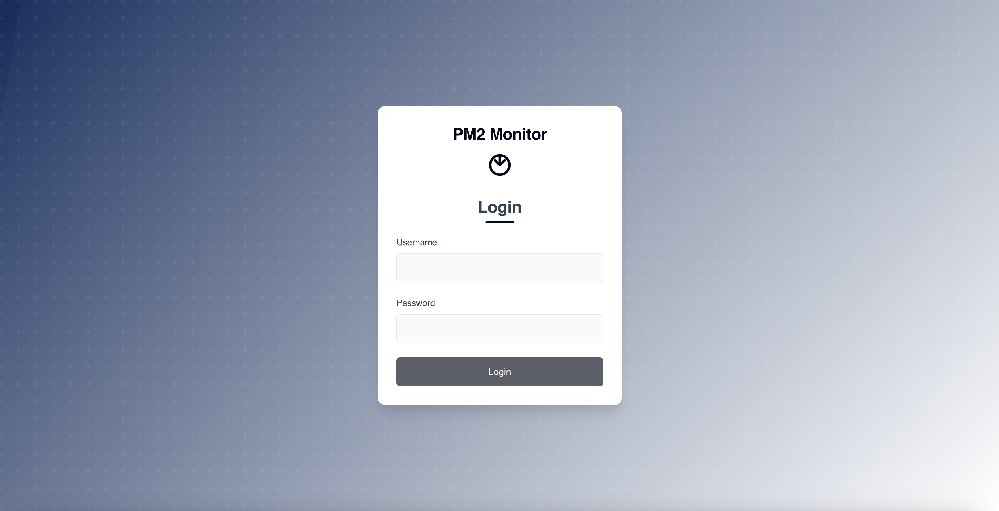
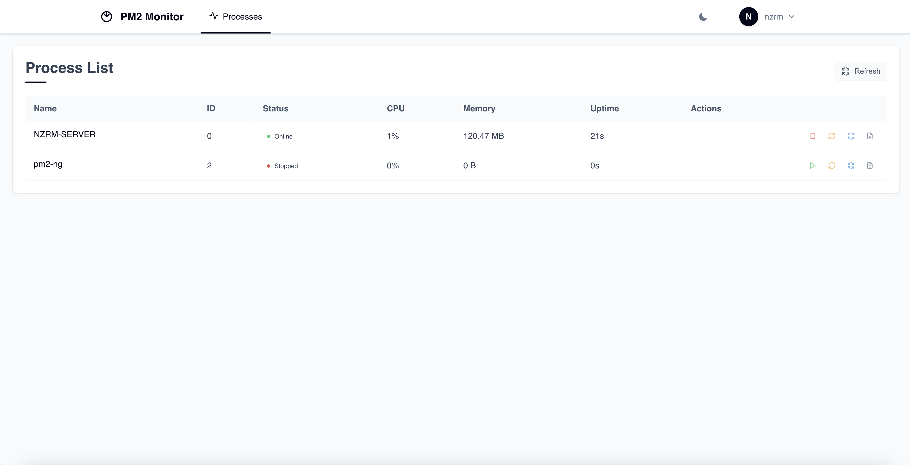
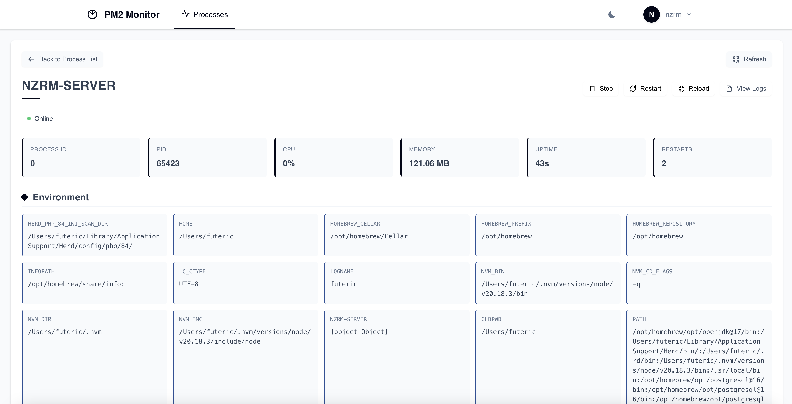
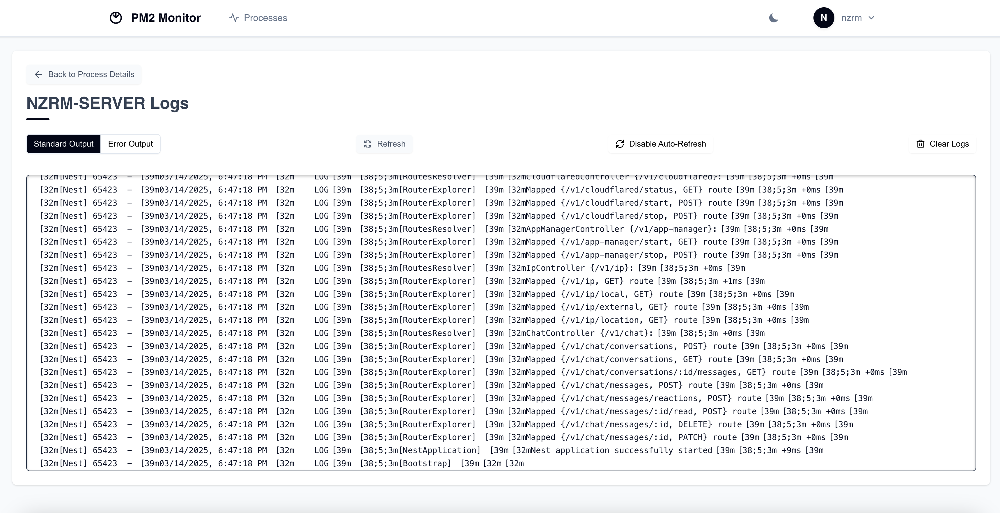
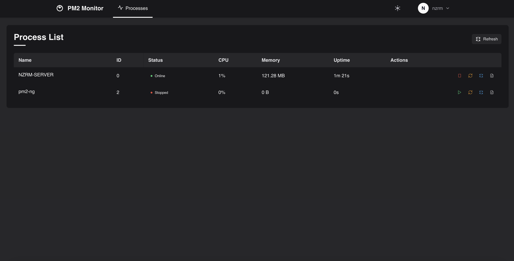

# PM2 Monitor

A modern web-based monitoring dashboard for PM2 process manager with dark/light theme support.

<p align="center">
  
  
  
</p>

## Features

- **Process Monitoring**: Real-time monitoring of all PM2 processes
- **Process Management**: Start, stop, restart, and reload processes
- **Detailed Process Information**: View CPU usage, memory consumption, uptime, and more
- **Environment Variables**: Inspect environment variables for each process
- **Log Viewing**: Access standard and error logs with auto-refresh capability
- **Authentication**: Secure login system to protect your process management
- **Theme Toggle**: Switch between dark and light modes for comfortable viewing
- **Responsive Design**: Works on desktop and mobile devices

## Screenshots

### Authentication


### Process List


### Process Details


### Log Viewer


### Dark Theme


## Installation

### Prerequisites

- Node.js (v18 or higher)
- PM2 installed globally (`npm install pm2 -g`)

### Setup

1. Clone the repository:
   ```bash
   git clone https://github.com/NizarMasadeh/PM2-NG.git
   cd PM2-NG
   ```
2. Install frontend dependencies:
   ```bash
   npm i
   ```
3. Install backend dependencies:
   ```bash
   cd backend
   npm i
   ```
4. Create an `.env` file in the `backend` directory:
   ```bash
   cp .env.example .env
   ```
   - Open `.env` and update the JWT_SECRET as needed.

5. Navigate back to the root directory:
   ```bash
   cd ..
   ```
6. Start the development server:
   ```bash
   npm run dev
   ```
7. Access the application:
   - Frontend: `localhost:4141`
   - Backend: Runs automatically on port `3000`

